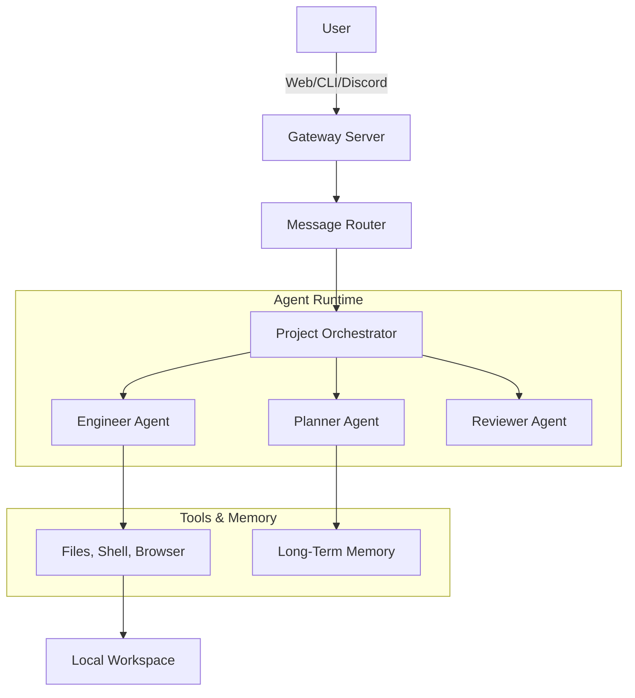

# 🦞 Wingman

> **Your Local, Agentic AI Co-Pilot.**

[](https://opensource.org/licenses/MIT)
[](https://www.python.org/downloads/)
[](https://github.com/psf/black)

**Wingman** is a powerful, locally-hosted AI assistant designed for developers. It combines the flexibility of local LLMs (like **Kimi K2.5** via Ollama) with a sophisticated multi-agent framework capable of planning, coding, and reviewing complex software projects autonomously.

Think of it as an open-source, local alternative to Devin or Cursor's Agent mode, but fully under your control.

---

## ✨ Features

### 🧠 **Multi-Agent Project Mode**
Wingman doesn't just chat; it builds. In **Project Mode**, a team of specialized agents works together:
-   **Planner**: Breaks down your request into a step-by-step implementation plan.
-   **Engineer**: Writes the actual code, executing terminal commands and file operations.
-   **Reviewer**: Validates the code, runs linters, and ensures quality before completion.

### 🏠 **100% Local & Private**
-   **Local Inference**: Powered by **Ollama** ensures your code never leaves your machine unless you want it to.
-   **Cloud Option**: Seamlessly switch to **Gemini 2.5 Flash** (Free Tier) or **Moonshot AI** for massive context windows (up to 256k tokens).

### 💬 **Multi-Channel Interface**
Interact with Wingman wherever you are:
-   **WebChat**: A beautiful, modern React-like interface with markdown support, code highlighting, and project visualization.
-   **CLI**: Quick interactions directly from your terminal (`wingman chat`).
-   **Discord & Telegram**: Connect Wingman to your favorite messaging platforms.

### 🛠️ **Extensible Toolset**
Wingman comes equipped with a powerful suite of tools:
-   **File System**: Read, write, and edit files safely.
-   **Terminal**: Execute shell commands.
-   **Web Search**: Browse the web for real-time information (DuckDuckGo/Brave).
-   **Browser**: Headless browser automation for scraping and interaction.

---

## 🚀 Getting Started

### Prerequisites

-   **Python 3.11+**
-   **Ollama** (recommended for local inference)
    -   Run: `ollama pull kimi-k2.5:cloud` (or your preferred model)

### Installation

1.  **Clone the repository**:
    ```bash
    git clone https://github.com/siddharthprakash1/wingman.git
    cd wingman
    ```

2.  **Install dependencies**:
    ```bash
    pip install -e .
    ```

3.  **Initialize Configuration**:
    ```bash
    wingman onboard
    ```
    This will create `~/.wingman/config.json` and set up your workspace.

---

## 📖 Usage

### Start the Gateway (Web UI + API)

The Gateway is the brain of Wingman, hosting the WebChat and handling API requests.

```bash
wingman gateway
```

> **Access the UI**: Open [http://localhost:18789](http://localhost:18789) in your browser.

### CLI Chat

Need a quick answer? Use the CLI:

```bash
wingman chat "How do I reverse a binary tree in Python?"
```

---

## ⚙️ Configuration

Your configuration lives in `~/.wingman/config.json`. You can easily switch models, enable/disable tools, and configure API keys.

**Example `config.json`:**

```json
{
  "agents": {
    "defaults": {
      "model": "ollama/kimi-k2.5:cloud",
      "temperature": 0.7
    }
  },
  "providers": {
    "kimi": { "api_key": "sk-..." },
    "gemini": { "api_key": "..." }
  },
  "tools": {
    "web": { "search": { "provider": "duckduckgo" } }
  }
}
```

---

## 🏗️ Architecture

Wingman uses a **Hub-and-Spoke** architecture:



---

## 🤝 Contributing

Contributions are welcome! Please feel free to submit a Pull Request.

## 📄 License

This project is licensed under the MIT License - see the [LICENSE](LICENSE) file for details.
